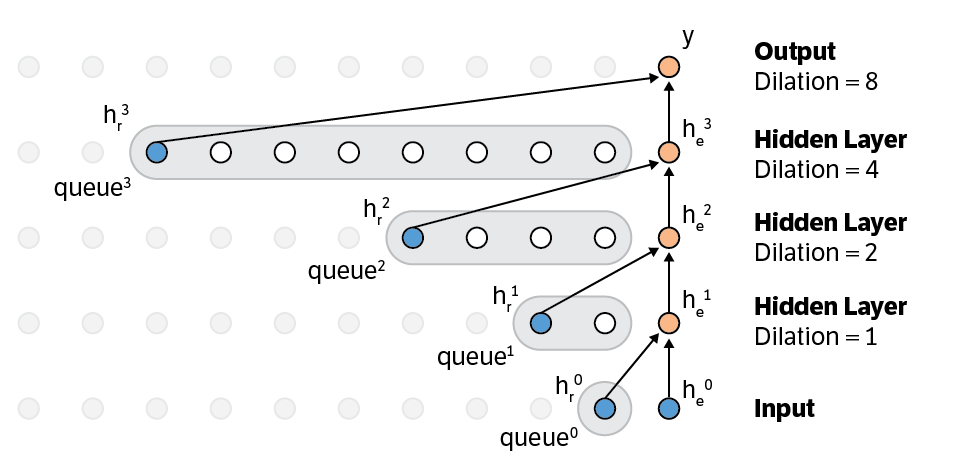
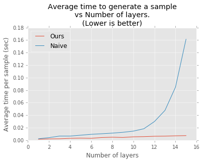
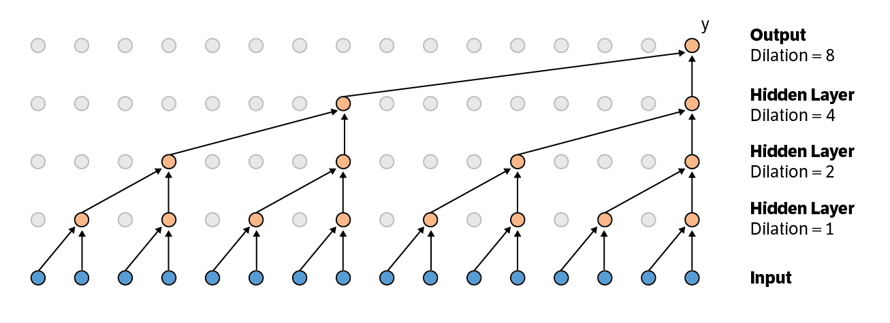
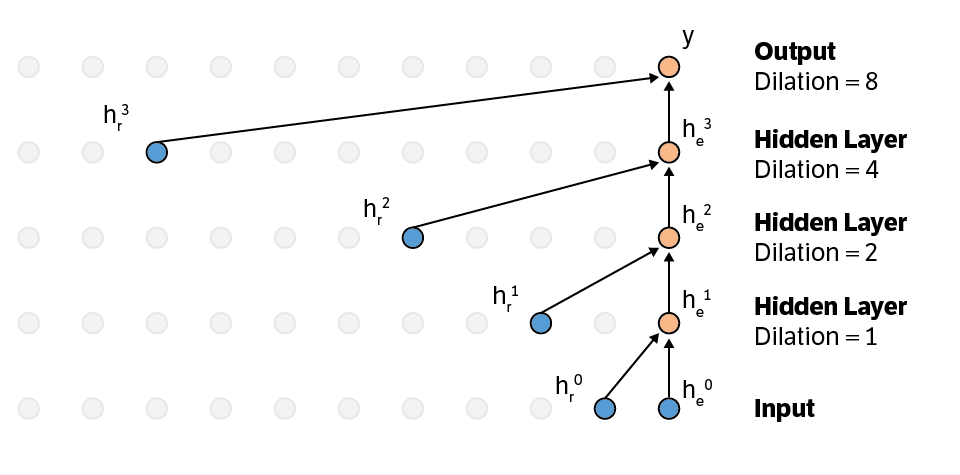
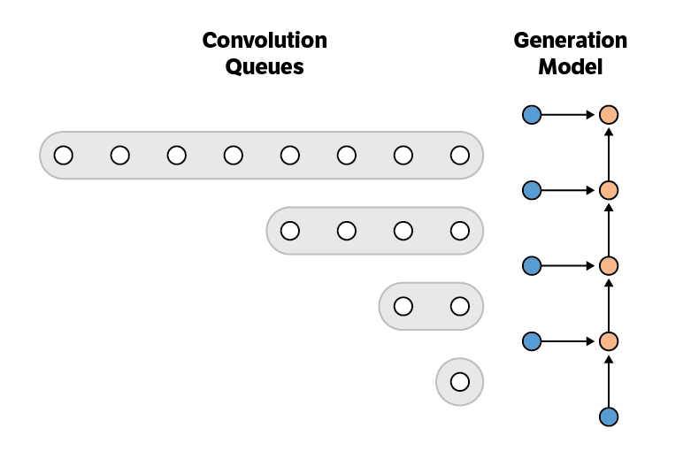
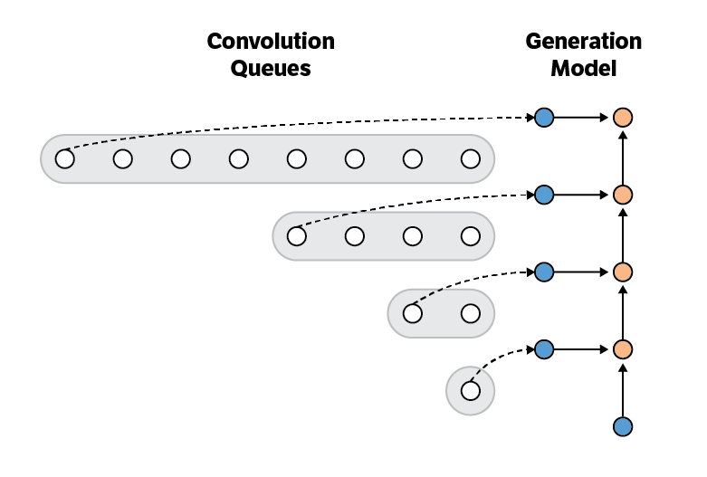
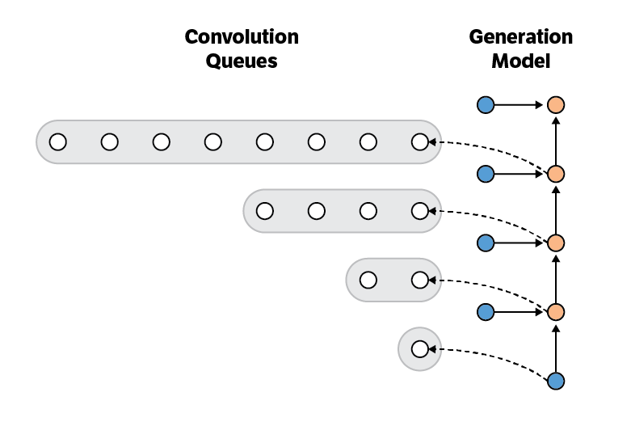

# Fast Wavenet: An efficient Wavenet generation implementation

<p align="center">
    
</p>

Our implementation speeds up Wavenet generation by eliminating redundant convolution operations. A naive implementation of Wavenet generation is O(2^L), while ours is O(L), where L is the number of layers.

While other Wavenet repos focus on training on a large corpus of data and generating samples, ours mostly describes an efficient generation algorithm (which is super simple), and provides an example implementation.

We note that while not explicitly stated in the Wavenet paper, we talked to the authors, and they are doing something similar.

For more about Wavenet, see DeepMind's [blog post](https://deepmind.com/blog/wavenet-generative-model-raw-audio/).

If you find this work useful and use it on your own research, please cite our [paper](https://arxiv.org/abs/1611.09482). 

```
@article{paine2016fast,
  title={Fast Wavenet Generation Algorithm},
  author={Paine, Tom Le and Khorrami, Pooya and Chang, Shiyu and Zhang, Yang and Ramachandran, Prajit and Hasegawa-Johnson, Mark A and Huang, Thomas S},
  journal={arXiv preprint arXiv:1611.09482},
  year={2016}
}
```

## Timing experiments

<p align="center">
    
</p>

We generated from a model with 2 blocks of L layers each, using a naive implementation and ours. Results are averaged over 100 repeats. When L is small the naive implementation performs better than expected due to GPU parallelization of the convolution operations. But when L is large, the efficient implementation really shines.

## General purpose
While this algorithm works well for auto-regressive models like Wavenet, it would be useful anytime you need to run a causal dilated convolutional neural network fast. For instance: classification/regression on streaming data.

## Authors (helped via pair coding)
- [Tom Le Paine](https://github.com/tomlepaine)
- [Pooya Khorrami](https://github.com/pkhorrami4)
- [Prajit Ramachandran](https://github.com/PrajitR)
- [Shiyu Chang](https://github.com/code-terminator)

## Acknowledgements (helped via conversation)
- [Wei Han](https://github.com/weihan3)
- Yang Zhang
- Yuchen Fan

---

## Algorithm motivation
Here we focus on generation for dilated causal convolution networks (E.g. Wavenet) with filter size 2. Though these ideas generalize to larger filter sizes.

During generation, the computational graph used to compute a single output value can be seen as a binary tree.

<p align="center">
    
</p>
The input nodes (blue) are the leaves of the tree, and the output is the root. The intermediate computations are the red nodes. The edges of the graph correspond to matrix multiplies. Since the computation is a binary tree, the overall computation time for graph is O(2^L). When L is large, this is horrible.

However, since this model is being applied repeatedly over time, there is a lot of redundant computation, which we can cache to increase the speed of generating a single sample.

The key insight is this: given certain nodes in the graph, we have all the information we need to compute the current output. We call these nodes the **recurrent states** in analogy to RNNs. These nodes have already been computed, all we need to do is cache them.

<p align="center">
    
</p>

Note that at the next time point, we will need a different subset of recurrent states. As a result we need to cache several **recurrent states** per layer. The number we need to keep is equal to the **dilation** of that layer.

<p align="center">
    
</p>

## Algorithm components
The algorithm has two components:
- **Generation Model**
- **Convolution Queues**

<p align="center">
    
</p>

The generation model can be viewed as 1 step of a recurrent neural network. It takes as input: the current observation and several recurrent states, and computes: the output prediction and new recurrent states.

The convolution queues store the new recurrent states which have been computed by the layer below.

## Algorithm
Initialize the **generation model** with the weights from the pre-trained convolutional network.
For each layer, initialize the **convolution queue**. The max length of the queue equals the dilation of that layer. Fill it with zero recurrent states. (See above).

Repeat:
- Pop phase
- Push phase

**Pop phase**: For each **convolution queue** pop the **recurrent state** and feed it to the corresponding state of the **generation model**, then calculate the new hidden states and output.

<p align="center">
    
</p>

**Push phase**: For each new hidden state push it into the **convolution queue** of the layer above.

<p align="center">
    
</p>

